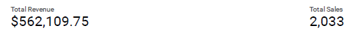
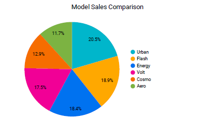
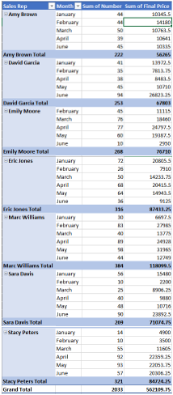
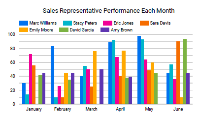
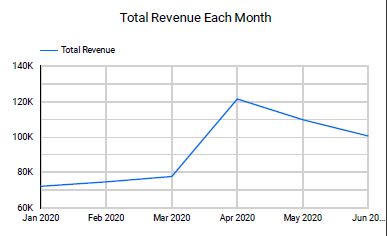
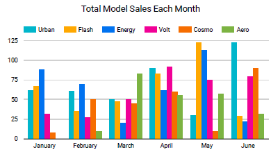

# Mid-Year Report Chair Company

This repository is about a Mid-Year Sales Report of a Chair Company (Period: January 2021 - June 2021)

### General
The company earned a total revenue of $562,109.75 with total sales of 2,033 all chair models during the period from January 2021 to June 2021. Here are the score-cards about it:

### The Most Sold Chair Model

From the data, we can conclude that the most sold chair model is Urban with 20.5% of the total sales from all chair models. Here is the Pie Chart about it:

### Sales Representative with the Best Performance
Sales Representative with the Best Performance (Most sales and highest revenue) is Marc William. Here is the Pivot Table and Bar Chart about this data:

From the bar chart, we can see that the sales of Marc William are represented in dark blue. In each month, Marc William can always have items sold and often get the highest sales figures, especially in February and May, so he can get high sales figures in this period.

### Monthly Revenue
Here is the Line Chart about monthly revenue from this company and bar chart about monthly model sales:

The company's revenue figures increased from January to April, where April saw the most sales during this period. This happened because, in April, sales were evenly distributed on all seat models, in addition, there were quite high sales on models with high selling prices, namely Cosmo, Energy, and Volt. This chair model certainly contributed a large income in April. The order of the selling price of the chair models from the highest to the lowest is:
1. Cosmo - $375
2. Energy - $350
3. Volts - $295
4. Urban - $260
5. Flash - $235
6. Aero - $220

However, from May to June there was a decline in sales of these models, resulting in a decline in the company's revenue

The dashboard about this data can be seen on Google Data Studio, link: [Google Data Studio](https://datastudio.google.com/reporting/01193596-9e1f-46d0-96ad-cccd5247b046)